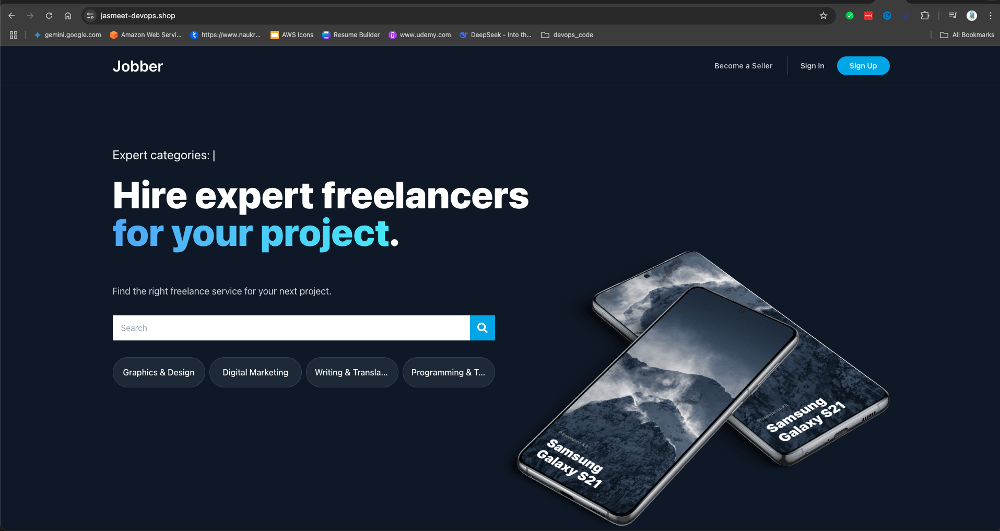

## Atlan - Assesment E-commerce App on AWS EKS:

## 📚 Table of Contents
1. [Overview](#atlan---assesment-e-commerce-app-on-aws-eks)
2. [Application Architecture](#-core-components)
3. [Infrastructure Deployment (Terraform)](#infrastructure-deployment-using-terraform)
4. [Terraform Structure with Remote State and Module Reuse](#terraform-structure-with-remote-state-and-module-reuse)
5. [Cluster Autoscaler](#cluster-autoscaler--why-karpenter-was-used-)
6. [Deploy Resources Related to App](#deploy-resources-related-to-app)
7. [Accessing the App](#accessing-the-app)
8. [Observability in EKS Cluster](#observability-in-eks-cluster)
9. [Login to Grafana](#login-to-grafana)
10. [Adding Loki to Grafana](#adding-loki-to-grafana)
11. [Login to Kibana(Elasticsearch)](#login-to-kibanaelasticsearch)

E-Commerce Microservices Application - Kubernetes Deployment

📄 Overview

This is a production-ready, cloud-native E-commerce platform built using a microservices architecture. The application simulates a real-world freelancing or services marketplace (similar to Fiverr) and is deployed on Amazon EKS with full observability, scaling, and security mechanisms in place.



### 🧱 Core Components

| Layer         | Component                       | Technology                   |
|---------------|----------------------------------|------------------------------|
| Frontend      | User Interface                  | React + Nginx               |
| API Gateway   | Unified Entry Point             | Node.js (Express)           |
| Microservices | Auth, Users, Gigs, Messages, Orders, Reviews | Node.js (Express) |
| Database      | Data Persistence                | MongoDB, MySQL, PostgreSQL, ElasticSearch |
| Queue         | Asynchronous Messaging          | RabbitMQ                    |
| Observability | Logs, Metrics, Traces           | Loki, Prometheus, Grafana|
| Secrets       | Credentials Management          | AWS Secrets Manager         |
| Ingress       | Routing and TLS Termination     | AWS ALB Ingress Controller  |


### Communication Flow:

Frontend ➔ Gateway ➔ Microservices (via REST)

Microservices ↔ MongoDB / PostgreSQL / MySQL (internal DB calls)

Gateway ➔ ElasticSearch + APM (Tracing)

Microservices ➔ RabbitMQ ➔ Other Services (event-driven async communication)

Logs from all pods ➔ Alloy ➔ Loki

Metrics ➔ Prometheus ➔ Grafana Dashboards


### Infrastructure Deployment Using Terraform:
To ensure consistency across environments (dev, staging, production), the infrastructure is built using a modular Terraform architecture with environment-specific configuration managed via YAML files. Each module (like VPC, EKS, Karpenter) dynamically reads its values based on the active Terraform workspace using a shared locals block. This approach enables a single codebase to cleanly manage infrastructure across multiple AWS accounts or environments without duplication, while preserving clarity, reusability, and automation best practices.

### Terraform Structure with Remote State and Module Reuse:
This Terraform architecture follows a modular design with separate directories for major infrastructure components such as vpc/, eks/, and plugins/ (e.g., metric server, ALB ingress controller, external-dns). Each module uses a remote backend (S3 ) to store its state files securely and consistently.

**To ensure dependency management between modules:**

* The VPC resources are provisioned first, and their outputs (like subnets, VPC ID) are stored in remote state.

* The EKS module consumes these outputs using **terraform_remote_state** data sources to maintain a clear separation of concerns without hardcoding values.

* Plugin modules are deployed after the EKS cluster is ready.

This setup ensures reproducibility, state isolation, and reliable cross-module references across all environments. Terraform Files are Present in Folder eks-terraform-infra.
#### 1. Deploy Network Resources --> **1_network:**
* Network resources like VPC , Subnets , NAT Gateways are stored in folder 1_network.
* Run Terraform init and create dev namespace. (you can use/create any NS).
* Finally Run Terraform apply to create networking resources.


#### 2. Provision EKS Cluster --> **2_compute:**
* In this folder EKS Cluster related terraform files are present.
* By running terraform apply EKS CLuster , Karpenter, OIDC and Managed Node Groups will be created.
* Terraform init and select desried NS
* Finally Run Terraform apply to create EKS Cluster.

#### 3. Install/Deploy Adds-ons --> **3_plugins:**
* This folder contans all the terraform files to deploy plugins.
* ALB Ingress Controller, External-Dns, EBS-CSI, Grafana/Prometheus and Metrics Server.

##  Cluster Autoscaler == > Why Karpenter Was Used ?
Karpenter is an open-source, flexible, and high-performance Kubernetes cluster autoscaler built by AWS. In this setup, Karpenter is used instead of the traditional EKS Cluster Autoscaler due to its speed, flexibility, and efficiency.

#### Benefits of Using Karpenter Over EKS Cluster Autoscaler:
* Faster Scaling: Karpenter reacts quickly to pending pods and provisions new nodes in seconds, while Cluster Autoscaler can take longer due to scheduled polling intervals.

* Improved Cost Efficiency: Karpenter launches right-sized instances based on actual pod requirements (CPU/memory), reducing over-provisioning and costs.

* Supports Multiple Instance Types: It selects from a broad range of EC2 instance types and Availability Zones, improving availability and reducing spot interruptions.

* Simpler Configuration: No need to manage ASGs per node group; Karpenter works directly with the EC2 API, simplifying infrastructure.

By using Karpenter, we achieve faster provisioning, better resource utilization, and simplified node management, especially important for dynamic workloads like monitoring stacks (Grafana, Prometheus) and microservices.:  
#### All the Addons will be deployed on the AWS Manged Node Groups like ALB Ingress, Karpenter Pods, External-Dns Pods, EBS-CSI Pods

#### All the application pods and monitoring like Prometheus/Grafana will be deployed on Karpenter managed Node-pools.

## Deploy Resources related to App:

#### 1. To ensure secure and centralized management of sensitive application credentials, I integrated AWS Secrets Manager in this architecture. Unlike static Kubernetes Secrets, AWS Secrets Manager provides:

* Automatic rotation of secrets (if configured)

* Fine-grained IAM-based access control

* Cross-environment consistency for managing secrets across dev, staging, and prod

* Central auditability via CloudTrail logs for all secret access

By using the Secrets Store CSI driver with **syncSecret.enabled**, I was able to dynamically sync values from AWS Secrets Manager into Kubernetes native Secrets, allowing seamless access via secretKeyRef in deployments — without hardcoding or duplicating secrets across manifests.

This approach follows cloud-native best practices for security, compliance, and maintainability, making the solution both scalable and enterprise-ready.

```
1. Secret is already created in AWS Secret Manager named *** jobber-app-secrets **.
2. Secret Providers are already Installed through 3_plugins section and also a IAMServiceAccount named ** jobber-secret-reader ** is created. We are already using service account in all the deployments.
3. Go to folder ** jobber-k8s ** & Now run kubectl apply -f secret-provider-class.yaml 
3. This will create secretProviderClass which will create a native secret object and sync up this with aws secrets manager.
```

#### 2. Next Step is to create a IAMServiceAccount with same get/describe:secret permissions for the heartbeat and metricbeat deployments so that these 2 deployments can also use secrets from aws secret manager we need to provide the required permissions. For this IAMServiceAccount we will use the same polcy which is created in secret-store-csi.tf file named jobber-secret-access-eks-demo-dev
```
eksctl create iamserviceaccount \
  --name=heartbeat \
  --namespace=production \
  --cluster=eks-demo-dev-cluster \
  --role-name=heartbeat-irsa-eks-demo-dev \
  --attach-policy-arn=arn:aws:iam::307436399520:policy/jobber-secret-access-eks-demo-dev \
  --approve

eksctl create iamserviceaccount \
  --name=metricbeat \
  --namespace=production \
  --cluster=eks-demo-dev-cluster \
  --role-name=metricbeat-irsa-eks-demo-dev \
  --attach-policy-arn=arn:aws:iam::307436399520:policy/jobber-secret-access-eks-demo-dev \
  --approve

```

#### 3. After setting up Secrets and Service Accounts lets Start Deploying Resources in below order:
* Go to folder jobber-k8s.

```
- kubectl apply -f 15-jobber-redis
- kubectl apply -f 14-jobber-queue
- kubectl apply -f 13-jobber-postgreSQL
- kubectl apply -f 12-jobber-mysql
- kubectl apply -f 11-jobber-mongo
- kubectl apply -f 10-jobber-elasticsearch
```
* Now we need to get service account token for kibana from elasticseacrh so kibana can authenticate itself to elasticsearch.
* Exec into the elasticsearch pod and run below comamnd to reset the password for kibana user.

* kubectl exec -it jobber-elastic-5dd4c86544-54jwp -- bash
* Run this command it will reset the password for kibana user
``curl -s -X POST -u elastic:admin1234 -H "Content-Type: application/json" http://jobber-elastic.production.svc.cluster.local:9200/_security/user/kibana_system/_password -d "{\"password\":\"kibana\"}"   ``


* Now Generate a service token for kibana and copy the Token generated
```
bin/elasticsearch-service-tokens create elastic/kibana jobber-kibana
```

* Now Go to AWS Secret Manager and update the key **elasticsearch_service_account_token** with the new generated token.
* Now re-apply the secretProviderclass so that the new added secret gets sync with the secretProviderClass
```
kubectl apply -f secret-provider-class.yaml
```
* Now apply the Kibana Objects
```
kubectl apply -f 9-jobber-kibana
```

* After This we need to continue deploying other apps resources:
```
kubectl apply -f 8-review
kubectl apply -f 7-order
kubectl apply -f 6-chat
kubectl apply -f 5-gig 
kubectl apply -f 4-users 
kubectl apply -f 3-auth 
kubectl apply -f 2-notifications 
kubectl apply -f 1-gateway   
kubectl apply -f 0-frontend 
```

## Accessing the App
#### Why Ingress is Used in This Setup ?
Kubernetes Ingress is used to expose internal services (like Grafana, Prometheus, Kibana, and app services) to the internet via a single load balancer, managing external access through host-based routing, TLS termination, and health checks.
In this project, Ingress resources are configured to:

* Route traffic to specific services based on domain names (e.g., grafana.jasmeet-devops.shop, kibana.jasmeet-devops.shop).

* Use AWS ALB Ingress Controller to automatically provision and manage an Application Load Balancer.

* Terminate SSL using an ACM certificate and enforce HTTPS via redirects.

#### Why We Use 3 Different Ingress Resources ?
* Grafana and Prometheus share one Ingress:
  They both run on port 80.

* Simple host-based rules (grafana.jasmeet-devops.shop, prometheus.jasmeet-devops.shop) allow efficient grouping.

* They don’t require custom ports or unique health paths.

#### Kibana has a separate Ingress:

* Runs on port 5601, which requires different health check settings.

* Uses a specific health check path (/api/status) to pass ALB health checks.

* Isolated to prevent conflict with other services healtj checks.

#### App Services (e.g., frontend, backend APIs) use a dedicated Ingress:

* These services form the core application stack.

* They use different domains and have their own routing logic.

* This separation improves maintainability and isolation of workloads.


#### Now we need to deploy Ingress resource to acces our applications:

```
kubectl apply -f jobber-ingress

```

* After the ALB status is Active now you can start accessing the services:
 
      https://kibana.jasmeet-devops.shop     --> To Access Kibana
      https://jasmeet-devops.shop            --> To Access Main APP
      https://grafana.jasmeet-devops.shop    --> To Access grafana
      https://prometheus.jasmeet-devops.shop --> To Access prometheus

## Observability in EKS Cluster
To ensure deep visibility into the health, performance, and behavior of the EKS workloads, this setup leverages a comprehensive observability stack combining metrics, logs, and traces:

✅ Prometheus – Metrics Collection
Prometheus is deployed to collect real-time metrics from Kubernetes components and application workloads. It scrapes metrics from services like Node Exporter, Kube State Metrics, and custom applications, allowing precise monitoring of system health, resource usage, and application behavior.

✅ Grafana – Visualization and Dashboards
Grafana is used to build powerful dashboards from Prometheus metrics. It provides intuitive visualizations and enables alerting to proactively detect and respond to system anomalies.

✅ Loki + Alloy (formerly Promtail) – Log Aggregation
Logs from pods are collected using Alloy (Loki agent) and shipped to Loki, a log aggregation system that integrates natively with Grafana. This enables correlation between metrics and logs in a single pane for faster debugging and root cause analysis.

✅ ElasticSearch + Kibana – Application Logging Pipeline
While system logs are centralized in Loki, the application logs and metrics are also forwarded to ElasticSearch for long-term retention and advanced querying. Kibana is used as a secondary observability interface to explore structured logs and application-level analytics.

#### Login to Grafana:
* Get the secret for Grafana as its deployed using helm release:
```
kubectl get secret grafana -n production -o jsonpath="{.data.admin-password}" | base64 --decode && echo

```


* Now access **https://grafana.jasmeet-devops.shop**  and Use the Username **admin** and **password from above command**

* After logging in go to connections and click on add **Data Source**
* Here Add **Prometheus** as datasource and after it got added go to data sources and selcet prometheus
* Now for the **Connection Url** add **http://prometheus-server.production.svc.cluster.local
** and click on save&test. This will add promethus as dataSource.
* Now Click on Dashboards and on the right hand side click on **import** and import add use **ID 315** and selct the prometheus data source and click on Import. 

#### Adding Loki to Grafana:

* After logging in go to connections and click on add **Data Source**
* Here Add **Loki** and use URL **http://loki-gateway.production.svc.cluster.local
** and click on save&test. 
* Go to Explor and click on label Browser and selct any pod to view logs.


#### Login to Kibana(Elasticsearch):
* Access URL https://kibana.jasmeet-devops.shop  and Use username **elastic** and password.
* Here we can see the metrics for app and infrastructure
* In this setup the elasticsearch is showing only 2 hosts metrics this is because currently the agent metricbeat is running on only Karpenter Main node-class nodes.

